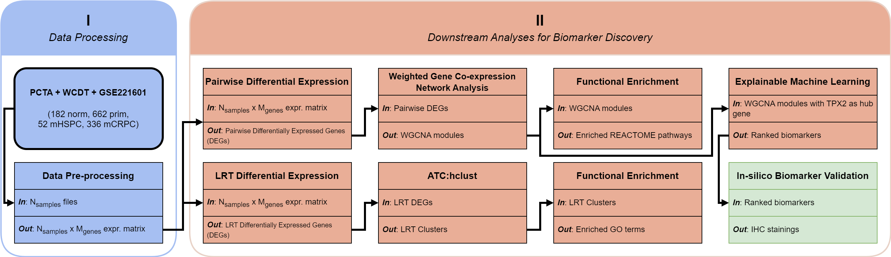

<div id="top"></div>

<!-- PROJECT LOGO -->
<br />
<div align="center">
  

  <h1 align="center">Identification of Biomarkers and Trajectories of Prostate Cancer Progression</h1>
  <h4 align="center">A Bioinformatics Fusion of Weighted Correlation Network Analysis and Machine Learning</h4>

</div>

<!-- TABLE OF CONTENTS -->
<details>
  <summary>Table of Contents</summary>
  <ol>
    <li>
      <a href="#about-the-project">About The Project</a>
      <ul>
        <li><a href="#data">Data</a></li>
      </ul>
    </li>
    <li>
      <a href="#getting-started">Getting Started</a>
      <ul>
        <li><a href="#prerequisites">Prerequisites</a></li>
        <li><a href="#installation">Installation</a></li>
        <li><a href="#usage">Usage</a></li>
        <li><a href="#file-descriptions">File descriptions</a></li>
      </ul>
    </li>
    <li><a href="#additional-notes">Additional Notes</a></li>
    <li><a href="#license">License</a></li>
    <li><a href="#contact">Contact</a></li>
    <li><a href="#acknowledgments">Acknowledgments</a></li>
    <li><a href="#citation">Citation</a></li>
  </ol>
</details>

## About The Project

This repository contains the code necessary to reproduce the results of *Identification of Biomarkers and Trajectories of Prostate Cancer Progression: A Bioinformatics Fusion of Weighted Correlation Network Analysis and Machine Learning*. See [publication](https://www.biorxiv.org/content/10.1101/2023.03.02.530740v2) for details.

The implementation was done in Python (with extensive use of [*rpy2*](https://github.com/rpy2/rpy2) wrappers) and R.

### Data

Our analysis relied on the following data sources:

- The Cancer Genome Atlas Prostate Adenocarcinoma (TCGA-PRAD) | [[Paper](https://pubmed.ncbi.nlm.nih.gov/26544944/)].
- Stand Up To Cancer - Prostate Cancer Foundation (SU2C-PCF) | [[dbGAP](https://www.ncbi.nlm.nih.gov/projects/gap/cgi-bin/study.cgi?study_id=phs000915.v2.p2)].

If you wish you reproduce the results shown in the paper, you must obtain the permissions from the owners of the data when required. Downloading and processing of the data is also a pre-requisite. Helper functions and scripts under `src/data` and `src/pipelines/data` were used for such purposes.

<p align="right">(<a href="#top">back to top</a>)</p>

<!-- GETTING STARTED -->

## Getting Started

### Prerequisites

You should have an Anaconda environment installed in your UNIX system (currently only Ubuntu/CentOS has been tested). I recommend using `Miniforge3`:

```bash
wget https://github.com/conda-forge/miniforge/releases/latest/download/Miniforge3-Linux-x86_64.sh
bash Miniforge3-Linux-x86_64.sh
```

More detailed instructions to setup Anaconda using Miniforge3 can be found [in their GitHub page](https://github.com/conda-forge/miniforge).

### Installation

Here's a step-by-step guide to setup the library:

1. Clone this repository:

  ```bash
  git clone https://github.com/CarlosUziel/wgcna_ml
  ```

2. Install mamba:

```bash
conda install -n base -c conda-forge mamba
```

3. Create virtual environment:

*Option 1:*
```bash
bash wgcna_ml/setup_env.sh
```

**Note**: Please keep in mind that `setup_env.sh` might include unnecessary dependencies, as this was a general environment we used for all our projects. You are invited to remove and add dependencies as you see fit.

*Option 2:*
```bash
mamba env create -f environment.yml # alternatively try environment_hist.yml
mamba activate bioinfo
```

This will take a while, have patience.

4. Set `PYTHONPATH` variable (preferably in your `.bashrc` file or equivalent):

```bash
export PYTHONPATH="/home/{user}/wgcna_ml/src":$PYTHONPATH
```

Now you are ready to start using the **GoiStrat** workflow!

<!-- USAGE EXAMPLES -->

### Usage

While this library contains plenty of ready-to-use scripts to build complete pipelines, it also provides multiple utility functions that can be used individually as per user needs. A special effort has been put into making the design of the library highly modular and flexible for different use cases. Feel free to submerge yourself in the codebase.

### File descriptions

This repository is organized as follows:

- `docs`: Files of the main workflow figure.
- `notebooks`: Multiple notebooks used for exploratory analyses. One notebook to reproduce all figures shown in the paper is included (`paper_figures.ipynb`).
- `src/components`: Component classes used in various pipelines, mainly for functional analysis.
- `src/data`: Helper functions for data processing.
- `src/pipelines`: Multiple individual scripts, each representing a step in the workflow. See details below for each step (in alphabetical order):
  - `src/pipelines/data`: Downloads data, its annotations and applies some minor pre-processing steps. Relevant R packages used here include **DESeq2**, **msigdbr** and **TCGAbiolinks**.
  - `src/pipelines/differential_expression`: Runs differential expression analyses with **DESeq2**, obtaining differentially expressed genes (DEGs) in the process.
  - `src/pipelines/fastq_processing`: Processes raw FASTQ files (SU2C-PCF dataset only). It includes quality control with **fasqc** and **multiqc**, adapter trimming with **cutadapt** and/or **trim-galore** and mapping using **STAR**.
  - `src/pipelines/functional_analysis`: Runs functional analyses (i.e. GSEA, ORA) on many gene sets collections (e.g. MSigDB H and C1-C8, DO, GO, Reactome, KEGG, MKEGG and NCG), obtaining enriched gene sets in the process. Relevant R packages used here include **clusterProfiler**, **dose**, **enrichplot**, **pathview** and **AnnotationHub**.
  - `src/pipelines/integrative_analysis`: Combines DEGs from different methods (i.e. DE, WGCNA and ML).
- `src/r_scripts`: Collection of R scripts used in this publication.
- `src/r_wrappers`: Python wrappers for all the underlying R packages used in the pipelines.
- `slurm`: Utility functions to run scripts on a SLURM system.

<br>

> This repository is an extract of all the code I developed during my PhD. While care has been taken to remove anything unrelated to this publication, some artifacts might still be present. In any case, they can be safely ignored.

<p align="right">(<a href="#top">back to top</a>)</p>

## Additional Notes

Source files formatted using the following commands:

```bash
isort .
autoflake -r --in-place --remove-unused-variable --remove-all-unused-imports --ignore-init-module-imports .
black .
```

<p align="right">(<a href="#top">back to top</a>)</p>

<!-- LICENSE -->

## License

Distributed under the MIT License. See `LICENSE` for more information.

<p align="right">(<a href="#top">back to top</a>)</p>

<!-- CONTACT -->

## Contact

Raheleh Sheibani Tezerji [[GitHub](https://github.com/Rahel14350) - [Google Scholar](https://scholar.google.com/citations?user=yblPwXoAAAAJ&hl=en) - [LinkedIn](https://www.linkedin.com/in/raheleh-sheibani-tezerji-62239693/)]

Carlos Uziel Pérez Malla [[GitHub](https://github.com/CarlosUziel) - [Google Scholar](https://scholar.google.es/citations?user=tEz_OeIAAAAJ&hl=es&oi=ao) - [LinkedIn](https://www.linkedin.com/in/carlosuziel) - [Twitter](https://twitter.com/perez_malla) - [Website](https://perez-malla.com/)]

<p align="right">(<a href="#top">back to top</a>)</p>

## Acknowledgments

This work was supported by grants provided by the FWF (National Science Foundation in Austria, grant no. P 32771) and DOC Fellowship of the Austrian Academy of Sciences (25276). The support from my PhD supervisors, Dr. Raheleh Sheibani and Prof. Dr. Gerda Egger was invaluable.

<p align="right">(<a href="#top">back to top</a>)</p>

## Citation

If you have found the content of this repository useful, please consider citing [this work](https://www.biorxiv.org/content/10.1101/2023.03.02.530740v2):

...

<p align="right">(<a href="#top">back to top</a>)</p>
